# tugas-pertemuan-ke-12
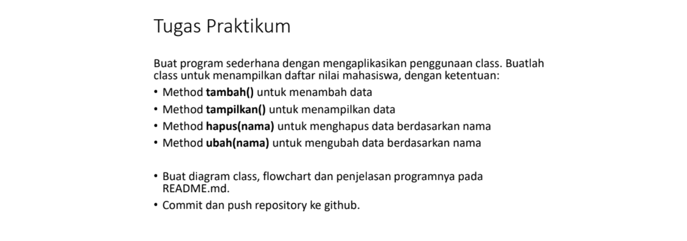
# Diagram Class
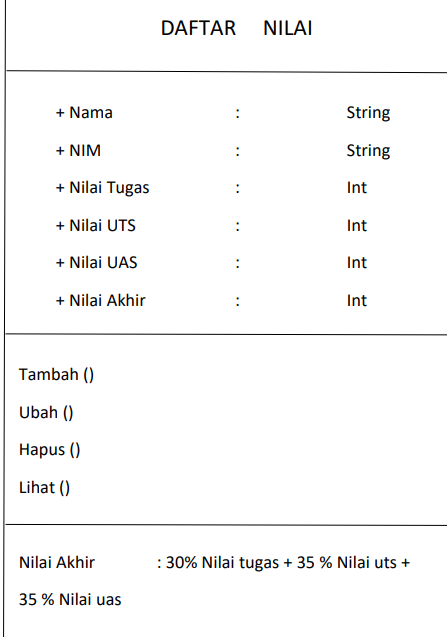
# Flow Chart
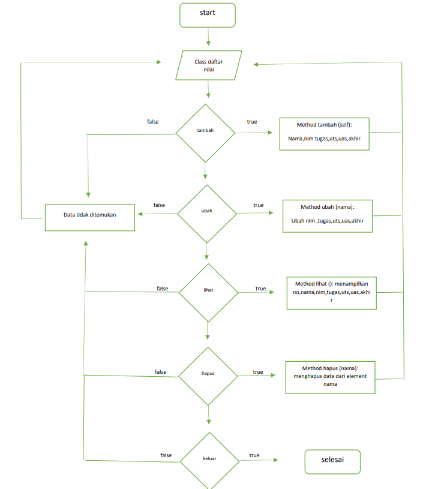 \

Pertama membuat dictionari kosong
```
data={}

```
Yang kedua membuat class daftar nilai
```
Class daftarNilai()
```
Lalu membuat beberapa method atau fungsi
```
def tambah(self)
def ubah(self)
def lihat(self)
def hapus(self)
```
Lanjut mengisi setiap method dengan elemennya
```
nama = input("masukan nama: ")
nim = input("masukan nim: ")
nilaiTugas = int(input("masukan nilai tuugas: "))
nilaiUts = int(input("masukan nilai uts: "))
nilaiUas = int(input("masukan nilai uas: "))
data[nama]=nim,nilaiTugas,nilaiUts,nilaiUas,nilaiAkhir
```
terakhir membuat looping dan membuat fungsi if else untuk menjalankan method
```
while True:
    x = daftarNilai()
    print('tambah\nubah\nlihat\nhapus\nkeluar')                                                                                     
    c = input("\nsilahkan masukan pilihan : ")

    if (c== 'tambah'):
        x.tambah()
    elif (c=="ubah"):
        x.ubah()
    elif (c=="lihat"):
        x.lihat()
    elif (c=="hapus"):
        x.hapus()
    elif (c== 'keluar'):
        x.keluar()
        break
    else:
        print('masukan pilihan dengan benar')
```

# Tampilan program di visual studio code : 
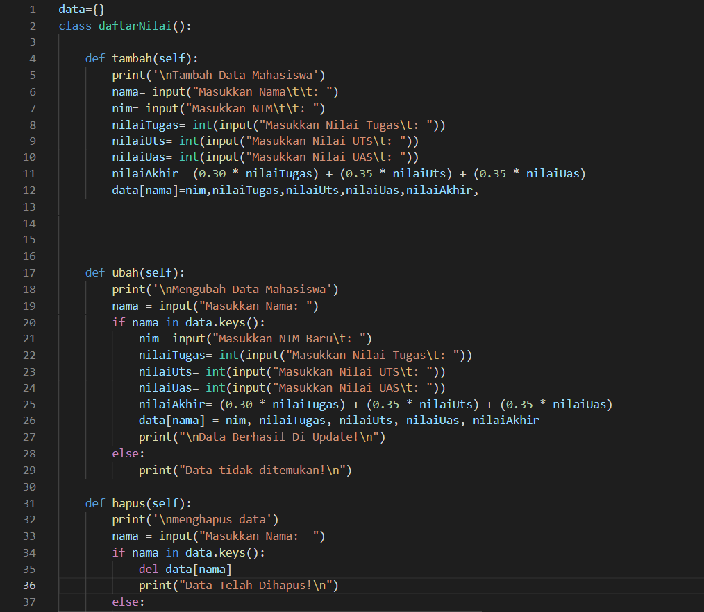 \
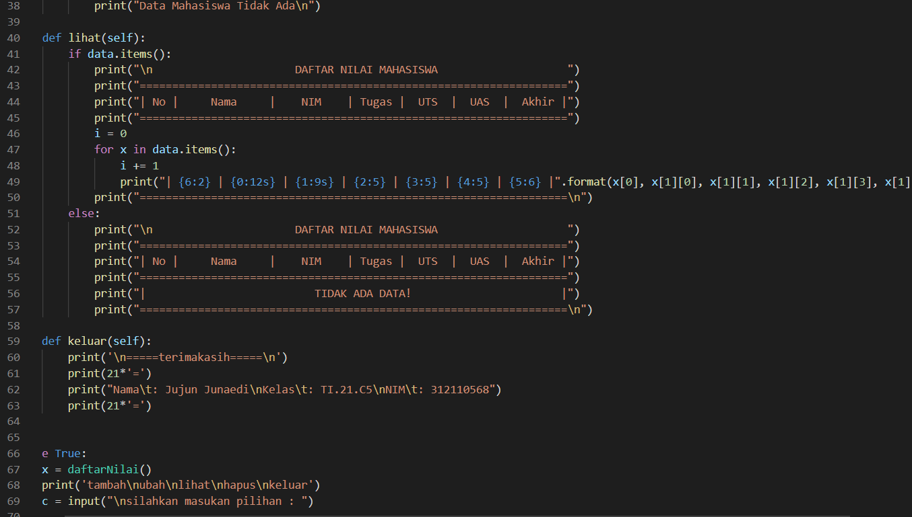 \
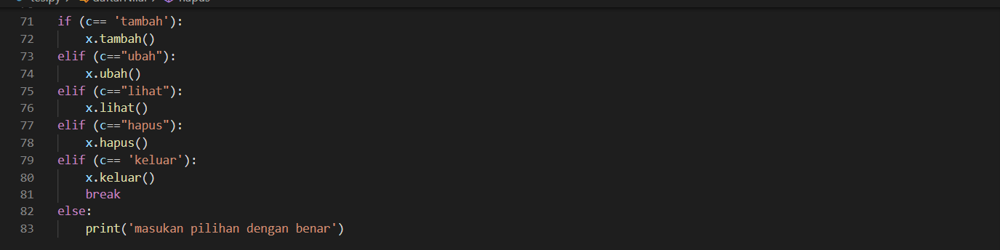 \

# Output program
output memilih tambah : \
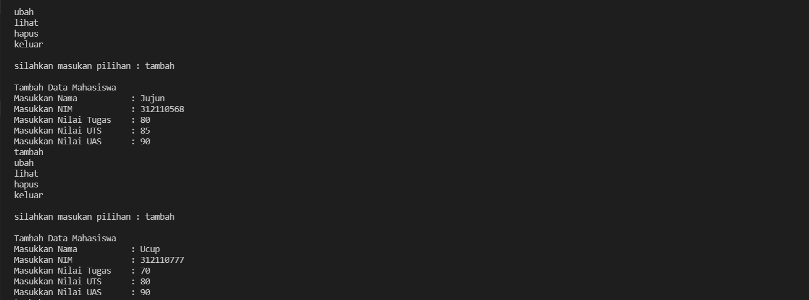\

output memilih lihat : \
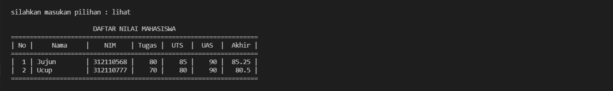\

output memilih ubah : \
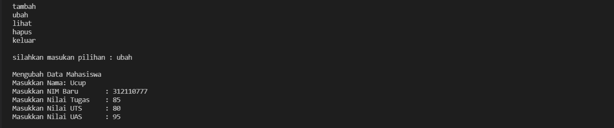

output memilih hapus : \
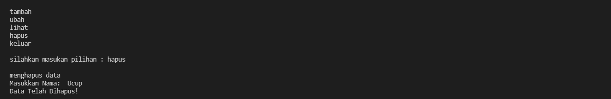\

ouput memilih keluar : \
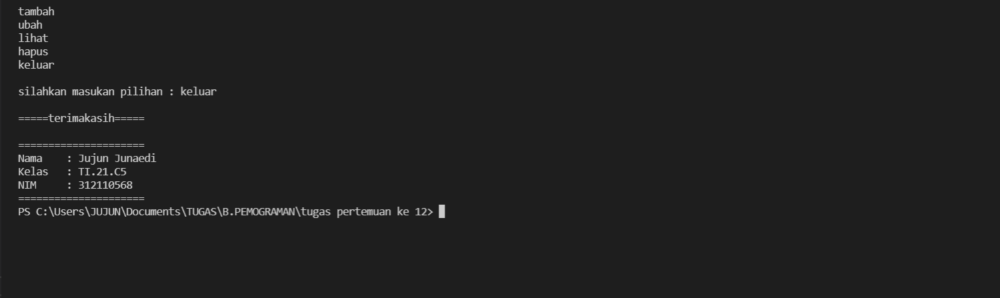